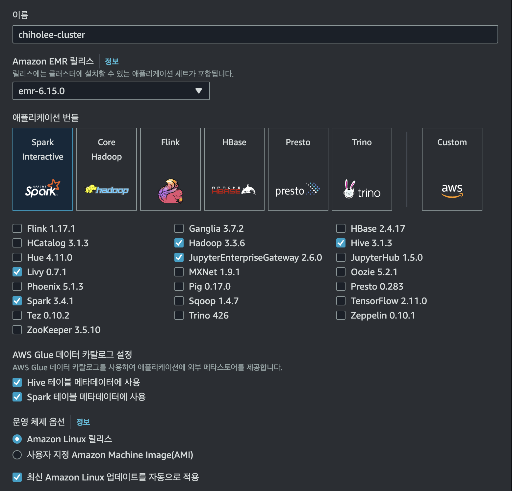

# EMR

## EMR 클러스터 생성



### Bootstrap 설정
아래 파일을 s3에 업로드 후 등록

```bash
#!/bin/bash
sudo pip3 install -U boto3
sudo timedatectl set-timezone Asia/Seoul
```

### Iceberg 사용을 위한 설정
```bash
[
  {
    "Classification": "iceberg-defaults",
    "Properties": {
      "iceberg.enabled": "true"
    }
  }
]
```


이 후 Iceberg의 bookmark 를 dynamoDB를 사용하므로 AmazonDynamoDBFullAccess 정책을 생성된 프로파일에 추가


