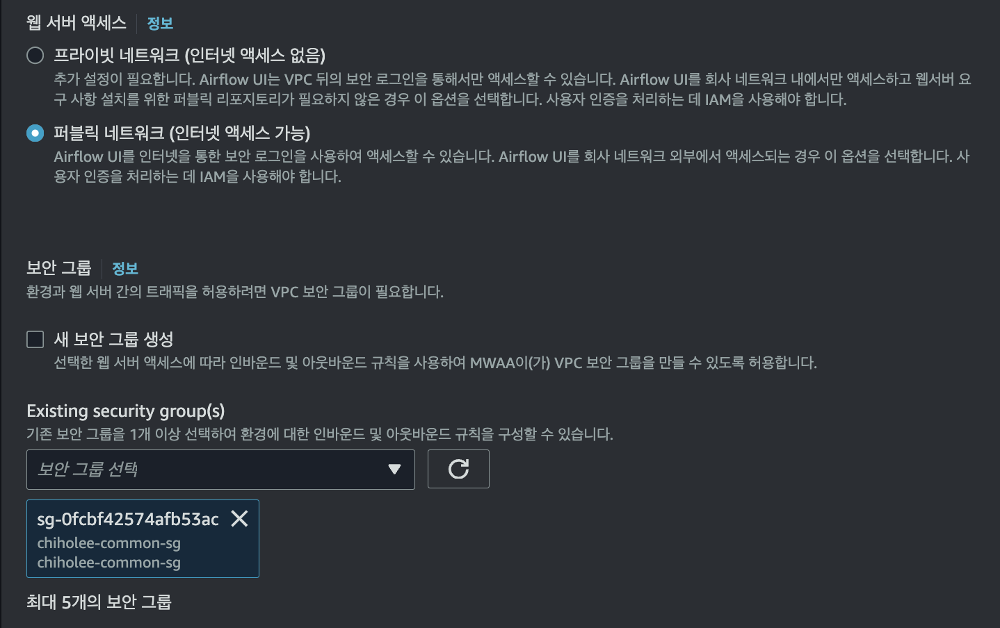

# MWAA(Airflow)

### 환경 변수 준비
```bash
export DATALAKE_DIR=/Users/chiholee/Desktop/Project/datalake
```

### MWAA 프로비저닝


기본값이 아닌, IaC를 통해 생성한 VPC 선택





역할에 AmazonEMRFullAccessPolicy_v2 정책 추가


> [!NOTE]  
> Amazon MWAA는 사용자를 대신하여 IAM에서 AmazonMWAA-XXXX(이)라는 이름의 실행 역할을 생성하고 수임합니다. 이 역할은 Amazon S3 버킷에서 코드를 검색하고 KMS 키를 사용하여 Amazon CloudWatch로 데이터를 전송할 수 있는 권한으로 구성됩니다. Airflow DAG가 다른 AWS 서비스에 액세스해야 하는 경우 실행 역할에 권한을 추가해야 합니다


# aws-mwaa-local-runner 를 통해 파이프라인 구축

## aws-mwaa-local-runner 환경 구축
1. airflow 설치
    ```bash
    cd $DATALAKE_DIR/07.mwaa
    python3 -m venv .venv
    source .venv/bin/activate
    pip install --upgrade pip
    pip install apache-airflow
    pip install 'apache-airflow[amazon]'
    ````

1. git clone
    ```bash
    git clone https://github.com/aws/aws-mwaa-local-runner.git
    cd $DATALAKE_DIR/07.mwaa/aws-mwaa-local-runner
    rm -rf .git
    ````
## 파이프라인 구축
### access_log_processing 파이프라인 구축
1. aws-mwaa-local-runner에 dag 복사, S3 경로와 EMR 클러스터 ID 변경
    ```bash    
    cd $DATALAKE_DIR/07.mwaa/aws-mwaa-local-runner
    S3_URI=s3://chiholee-datalake0002/src/processing/
    EMR_CLUSTER_ID=j-17W2Q4MSK5H0N
    sed -e "s|V_S3_URI|${S3_URI}|g" -e "s|V_EMR_CLUSTER_ID|${EMR_CLUSTER_ID}|g" ../src/access_log_processing.py > ./dags/access_log_processing.py
    ````

1. ./docker/docker-compose-local.yml 아래 내용 추가 (필요 시 8080 포트 수정)
    ```bash
    export AWS_PROFILE=XXXX
    export AWS_ACCESS_KEY_ID=$(aws configure get aws_access_key_id)
    export AWS_SECRET_ACCESS_KEY=$(aws configure get aws_secret_access_key)
    export AWS_DEFAULT_REGION=$(aws configure get region)
    ````

1. local docker 실행 후 docker 시작
    ```bash
    cd $DATALAKE_DIR/07.mwaa/aws-mwaa-local-runner
    ./mwaa-local-env build-image
    ./mwaa-local-env start
    ```

1. 0.0.0.0:8080 접속 후 admin/test 로그인
    
    


1. access_log_processing 토글을 enalbe 한 후 동작 여부 테스트 (테스트 후 토글 disable)

1. MWAA(Airflow) 테스트를 위해 local 에서 테스트한 dags를 MWAA 의 dags 디렉토리로 copy
aws s3 cp ./dags/access_log_processing.py s3://chiholee-datalake0002/mwaa/dags/

1. 토글 enable 후 동작 여부 테스트


1. S3에 전처리된 데이터 저장 확인


1. DynamoDB의 Bookmark 데이터터 확인


### orders_iceberg_cdc_from_kafka 파이프라인 구축
1. aws-mwaa-local-runner에 dag 복사, S3 경로와 EMR 클러스터 ID 변경
    ```bash    
    cd $DATALAKE_DIR/07.mwaa/aws-mwaa-local-runner
    S3_URI=s3://chiholee-datalake0002/src/processing/
    EMR_CLUSTER_ID=j-17W2Q4MSK5H0N
    sed -e "s|V_S3_URI|${S3_URI}|g" -e "s|V_EMR_CLUSTER_ID|${EMR_CLUSTER_ID}|g" ../src/orders_iceberg_cdc_from_kafka.py > ./dags/orders_iceberg_cdc_from_kafka.py
    ````

2. ./docker/docker-compose-local.yml 아래 내용 추가 (필요 시 8080 포트 수정)
    ```bash
    export AWS_PROFILE=XXXX
    export AWS_ACCESS_KEY_ID=$(aws configure get aws_access_key_id)
    export AWS_SECRET_ACCESS_KEY=$(aws configure get aws_secret_access_key)
    export AWS_DEFAULT_REGION=$(aws configure get region)
    ````

3. local docker 실행 후 docker 시작
    ```bash
    cd $DATALAKE_DIR/07.mwaa/aws-mwaa-local-runner
    ./mwaa-local-env build-image
    ./mwaa-local-env start
    ```

4. 0.0.0.0:8080 접속 후 admin/test 로그인
    
    


1. access_log_processing 토글을 enalbe 한 후 동작 여부 테스트 (테스트 후 토글 disable)

1. MWAA(Airflow) 테스트를 위해 local 에서 테스트한 dags를 MWAA 의 dags 디렉토리로 copy
aws s3 cp ./dags/orders_iceberg_cdc_from_kafka.py s3://chiholee-datalake0002/mwaa/dags/

1. 토글 enable 후 동작 여부 테스트


1. S3에 전처리된 데이터 저장 확인


1. DynamoDB의 Bookmark 데이터터 확인


