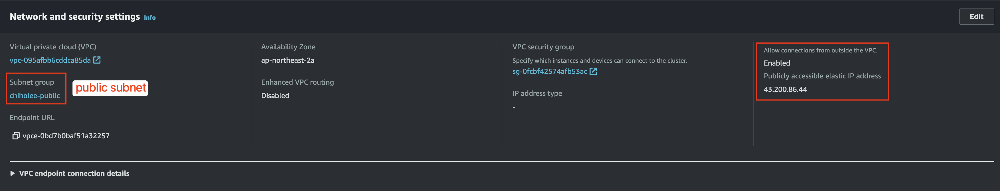
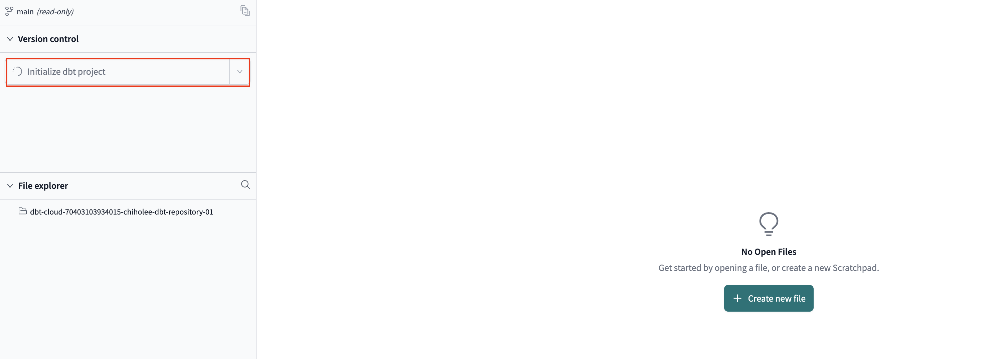

# Redshift 구축

### Create cluster subnet group


### Create Redshift Cluster


# MSK Integration with Redshift

### MSK 에서 데이터 Consume 을 위한 외부 스키마 생성
- IAM_ROLE : Redshift 의 Role
- AUTHENTICATION : MSK 인증 방식
- CLUSTER_ARN : MSK Cluster ARN

```sql
CREATE EXTERNAL SCHEMA msk
FROM MSK
IAM_ROLE default
AUTHENTICATION none
CLUSTER_ARN 'arn:aws:kafka:ap-northeast-2:590184105019:cluster/chiholee-msk/dcca849f-ddd1-4b79-b154-9bb0a31c2520-2';
```

### MVIEW 생성
```sql
-- Redshift Default Role 에 AmazonMSKFullAccess 정책 필요
drop MATERIALIZED VIEW mv_access_log_topic;
CREATE MATERIALIZED VIEW mv_access_log_topic AUTO REFRESH YES AS
SELECT "kafka_partition", 
"kafka_offset", 
"kafka_timestamp_type", 
"kafka_timestamp", 
"kafka_key", 
JSON_PARSE("kafka_value") as Data, 
"kafka_headers"
FROM msk.access_log_topic;

REFRESH MATERIALIZED VIEW mv_access_log_topic;

select * 
from mv_access_log_topic;
```


### Optional
```sql
drop MATERIALIZED VIEW mv_orders;
CREATE MATERIALIZED VIEW mv_orders AUTO REFRESH YES AS
SELECT "kafka_partition", 
"kafka_offset", 
"kafka_timestamp_type", 
"kafka_timestamp", 
"kafka_key", 
JSON_PARSE("kafka_value") as Data, 
"kafka_headers"
FROM msk."rdb.ecommerce.orders";

drop MATERIALIZED VIEW mv_customer;
CREATE MATERIALIZED VIEW mv_customer AUTO REFRESH YES AS
SELECT "kafka_partition", 
"kafka_offset", 
"kafka_timestamp_type", 
"kafka_timestamp", 
"kafka_key", 
JSON_PARSE("kafka_value") as Data, 
"kafka_headers"
FROM msk."rdb.ecommerce.customer";

drop MATERIALIZED VIEW mv_product;
CREATE MATERIALIZED VIEW mv_product AUTO REFRESH YES AS
SELECT "kafka_partition", 
"kafka_offset", 
"kafka_timestamp_type", 
"kafka_timestamp", 
"kafka_key", 
JSON_PARSE("kafka_value") as Data, 
"kafka_headers"
FROM msk."rdb.ecommerce.product";
```

# S3 연결 (External)

Redshift default 역할에 AWSGlueServiceRole 정책 추가
```sql
CREATE EXTERNAL SCHEMA IF NOT EXISTS ext_s3
FROM DATA CATALOG
DATABASE 'ecommerce'
IAM_ROLE default
```


# Kinesis 연결

# RDS 연결


# Public 접속



# DBT 연결




