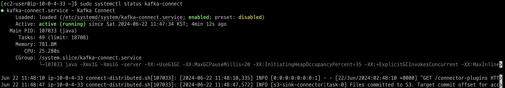
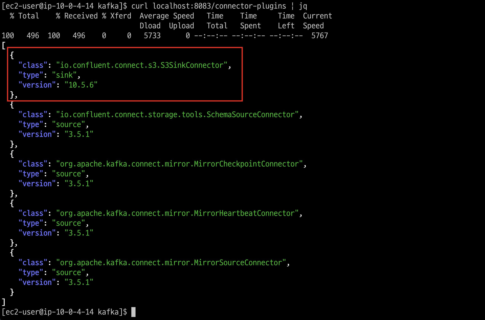
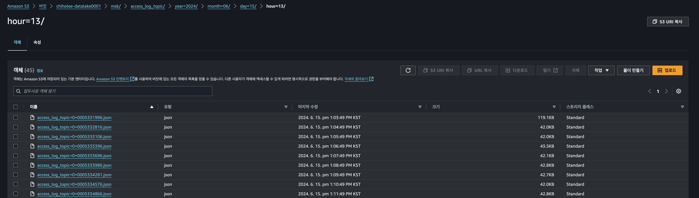
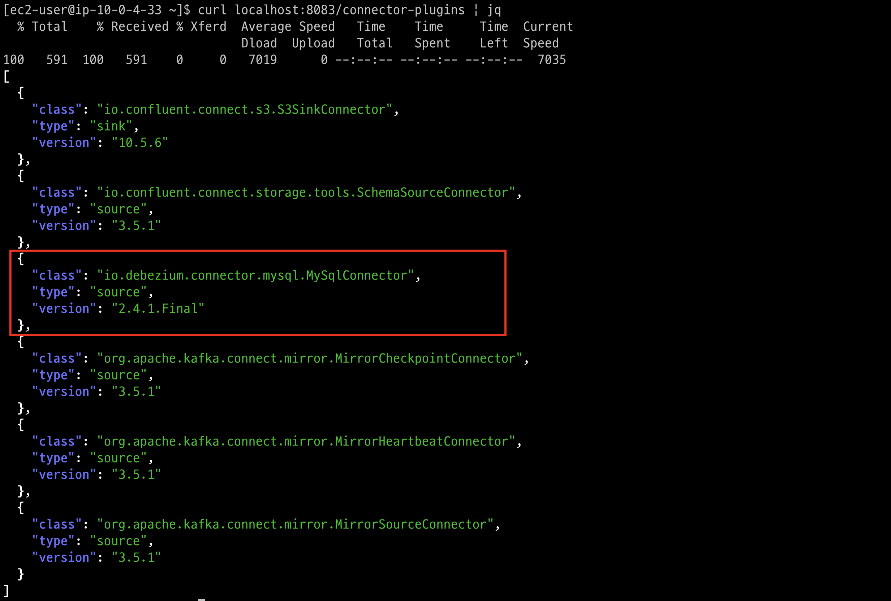
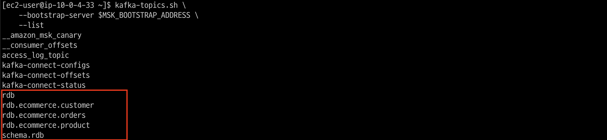
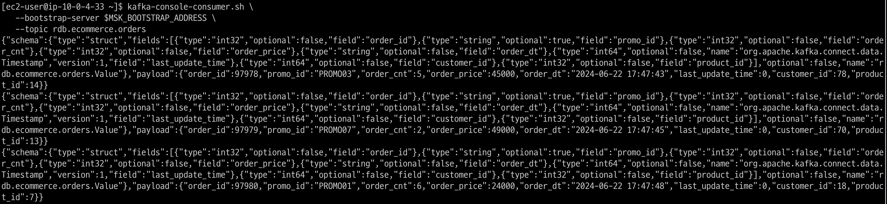
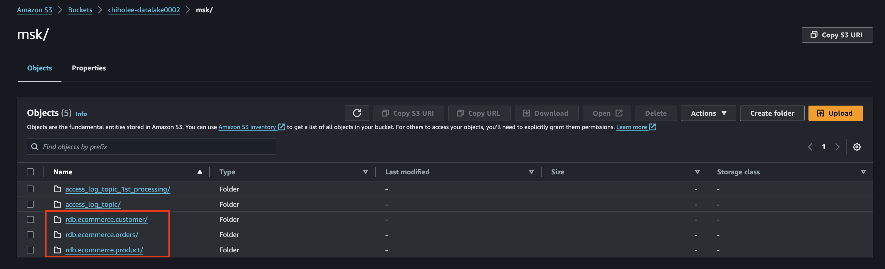
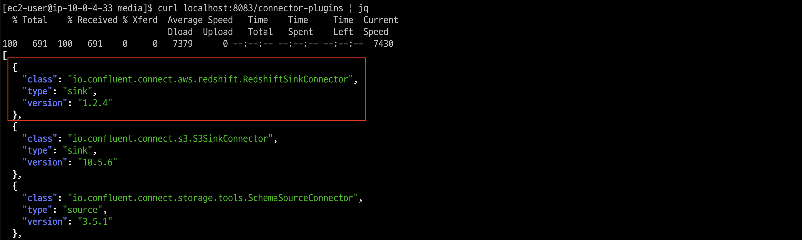
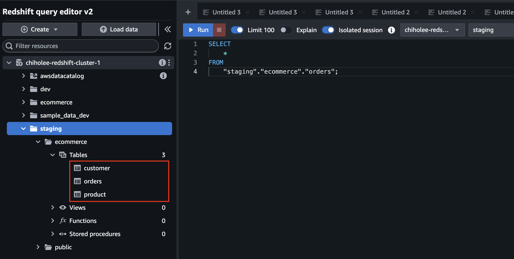

# MSK-CONNECT 구축

## Kafka-Connect & MSK Config Provider 설치
1. msk-config-providers 다운로드
   ```bash
   export HOME_DIR=~
   mkdir $HOME_DIR/kafka/plugins
   mkdir $HOME_DIR/kafka/plugins/msk-config-providers
   cd $HOME_DIR/media
   wget https://github.com/aws-samples/msk-config-providers/releases/download/r0.1.0/msk-config-providers-0.1.0-with-dependencies.zip
   sudo unzip msk-config-providers-0.1.0-with-dependencies.zip -d $HOME_DIR/kafka/plugins/msk-config-providers/
   cd $HOME_DIR/kafka/plugins/msk-config-providers/
   ```

2. connect-distributed.properties 설정
   ```bash
   cat << EOF > $HOME_DIR/kafka/config/connect-distributed.properties
   bootstrap.servers=$MSK_BOOTSTRAP_ADDRESS

   group.id=kafka-connect-cluster

   key.converter.schemas.enable=true
   key.converter=org.apache.kafka.connect.json.JsonConverter
   value.converter.schemas.enable=true
   value.converter=org.apache.kafka.connect.json.JsonConverter

   offset.storage.topic=kafka-connect-offsets
   offset.storage.replication.factor=2

   config.storage.topic=kafka-connect-configs
   config.storage.replication.factor=2

   status.storage.topic=kafka-connect-status
   status.storage.replication.factor=2

   offset.flush.interval.ms=10000
   plugin.path=$HOME_DIR/kafka/plugins
   EOF
   ```
3. Kafka-Connect systemctl 등록
   
   sudo vi /etc/systemd/system/kafka-connect.service
   ```bash
   [Unit]
   Description=Kafka Connect
   After=network.target

   [Service]
   User=ec2-user
   Group=ec2-user
   Environment="KAFKA_HEAP_OPTS=-Xmx1G -Xms1G"
   ExecStart=/home/ec2-user/kafka/bin/connect-distributed.sh /home/ec2-user/kafka/config/connect-distributed.properties
   Restart=on-failure
   RestartSec=10

   [Install]
   WantedBy=multi-user.target
   ```
   systemctl 등록, 상태 확인
   ```bash
   sudo chmod 644 /etc/systemd/system/kafka-connect.service
   sudo systemctl daemon-reload
   sudo systemctl start kafka-connect
   sudo systemctl enable kafka-connect
   sudo systemctl status kafka-connect
   ```
   

   로그, 프로세스 등 상태 확인
   ```bash
   tail -f /home/ec2-user/kafka/logs/connect.log
   ps -ef| grep connect-distributed.properties
   ```

   (optional) 테스트로 실행 필요 시   
   ```bash
   # 실행
   $HOME_DIR/kafka/bin/connect-distributed.sh -daemon $HOME_DIR/kafka/config/connect-distributed.properties
   # 프로세스 확인
   ps -ef| grep connect-distributed.properties
   # 포트 확인
   sudo netstat -antp | grep 8083
   ```

## Accesslog to S3 Connector 구축
### S3 Sink Connector(confluent) 셋팅
1. Confluent S3 Sink 다운로드
   ```bash
   export HOME_DIR=~
   cd $HOME_DIR; cd media
   wget https://d1i4a15mxbxib1.cloudfront.net/api/plugins/confluentinc/kafka-connect-s3/versions/10.5.6/confluentinc-kafka-connect-s3-10.5.6.zip
   sudo unzip confluentinc-kafka-connect-s3-10.5.6.zip -d $HOME_DIR/kafka/plugins/
   cd $HOME_DIR/kafka/plugins
   ```
   


1. Kafka-Connect Restart
   ```bash
   sudo systemctl restart kafka-connect
   ```

1. Connect 실행 로그 확인
   ```bash
   tail -f $HOME_DIR/kafka/logs/connect.log
   ```

1. Connect List 확인
   ```bash
   curl localhost:8083/connector-plugins | jq
   ````
   

> [!TIP]
> Connector 의 이름 기준으로 Source(MySQL) 부터 읽어오는 offset 을 관리하므로 Connector 에 버전관리를 해주는 것이 좋다. https://soojong.tistory.com/entry/Source-Connector-Offset-%EC%B4%88%EA%B8%B0%ED%99%94-%ED%95%98%EA%B8%B0
1. Sink Connector 생성
   ```bash
   export S3_BUCKET=chiholee-datalake0001
   export TOPICE_NAME=access_log_topic
   export S3_DIR=msk

   # flush.size : 1000건씩
   # rotate.interval.ms : 60000(1분마다)

   curl --location --request POST 'http://localhost:8083/connectors' \
   --header 'Content-Type: application/json' \
   --data-raw '{
     "name": "s3-sink-connector-v01",
     "config": {
      "connector.class":"io.confluent.connect.s3.S3SinkConnector",
   	"s3.region":"ap-northeast-2",
   	"flush.size":"1000",
      "rotate.interval.ms":"60000",
   	"schema.compatibility":"NONE",
   	"tasks.max":"1",
   	"topics":"'"$TOPICE_NAME"'",
   	"value.converter.schemas.enable":"false",
   	"format.class":"io.confluent.connect.s3.format.json.JsonFormat",
   	"key.converter":"org.apache.kafka.connect.storage.StringConverter",
   	"value.converter":"org.apache.kafka.connect.json.JsonConverter",
   	"storage.class":"io.confluent.connect.s3.storage.S3Storage",
   	"s3.bucket.name":"'"$S3_BUCKET"'",
      "topics.dir":"'"$S3_DIR"'",
   	"partition.duration.ms":"3600000",
   	"partitioner.class":"io.confluent.connect.storage.partitioner.TimeBasedPartitioner",
   	"path.format":"'\'year\''=YYYY/'\'month\''=MM/'\'day\''=dd/'\'hour\''=HH",
   	"timezone":"Asia/Seoul",
   	"locale":"ko_KR"
     }
   }' | jq
   ```

3. Sink Connector 확인
   ```bash
   # connect list
   curl --location --request GET 'http://localhost:8083/connectors' | jq
   # connect status
   curl --location --request GET 'http://localhost:8083/connectors/s3-sink-connector-v01/status' | jq
   # connect config
   curl -X GET "http://localhost:8083/connectors/s3-sink-connector-v01/config" | jq

   tail -f $HOME_DIR/kafka/logs/connect.log
   ```

4. Kafka Topic, Consume 상태 확인
   ```bash
   kafka-topics.sh \
    --bootstrap-server $MSK_BOOTSTRAP_ADDRESS \
    --list
    
   kafka-consumer-groups.sh \
   --bootstrap-server $MSK_BOOTSTRAP_ADDRESS \
   --list

   kafka-consumer-groups.sh \
   --bootstrap-server $MSK_BOOTSTRAP_ADDRESS \
   --group connect-s3-sink-connector-v01 --offsets --describe
   ```

### S3 확인


## MySQL to S3 Connector 구축
### MySQL Source Connector(debezium) 셋팅

1. debezium connect 다운로드
   ```bash
   export HOME_DIR=~
   cd $HOME_DIR
   cd media
   wget https://repo1.maven.org/maven2/io/debezium/debezium-connector-mysql/2.4.1.Final/debezium-connector-mysql-2.4.1.Final-plugin.tar.gz
   sudo tar zxvf debezium-connector-mysql-2.4.1.Final-plugin.tar.gz  -C $HOME_DIR/kafka/plugins/
   ```
1. Kafka-Connect Restart
   ```bash
   sudo systemctl restart kafka-connect
   ```

1. Connect 실행 로그 확인
   ```bash
   tail -f $HOME_DIR/kafka/logs/connect.log
   ```

1. Connect List 확인
   ```bash
   curl localhost:8083/connector-plugins | jq
   ````
   

> [!TIP]
> Connector 의 이름 기준으로 Source(MySQL) 부터 읽어오는 offset 을 관리하므로 Connector 에 버전관리를 해주는 것이 좋다. https://soojong.tistory.com/entry/Source-Connector-Offset-%EC%B4%88%EA%B8%B0%ED%99%94-%ED%95%98%EA%B8%B0

> [!TIP]
> snapshot.mode 의 Default 는 추가되는 메시지만, initial 은 전체 메시지를 가지고 온 후 변경을 반영한다.

아래 환경변수는 적절하게 변경한다.
1. MySQL Source Connector 생성
   ```bash
   export DB_HOSTNAME=chiholee.cluster-cz2ss0kqkbwh.ap-northeast-2.rds.amazonaws.com
   export DB_USER=admin
   export DB_PASSWORD=admin1234
   export DB_PORT=3306
   export DB_DATABASE=ecommerce
   export DB_TABLE_LIST=ecommerce.product,ecommerce.orders,ecommerce.customer

   curl -X POST 'http://localhost:8083/connectors' \
   --header 'Content-Type: application/json' \
   --data-raw '{
   "name": "mysql-to-s3-source-connector-v01",
   "config": {
         "connector.class":"io.debezium.connector.mysql.MySqlConnector",
         "tasks.max":"1",
         "transforms":"unwrap",
         "transforms.unwrap.type":"io.debezium.transforms.ExtractNewRecordState",
         "include.schema.changes":"true",
         "key.converter.schemas.enable":"true",
         "value.converter.schemas.enable":"true",
         "topic.prefix":"rdb",
         "database.hostname":"'"$DB_HOSTNAME"'",
         "database.port":"'"$DB_PORT"'",
         "database.server.id":"123411",
         "database.user":"'"$DB_USER"'",
         "database.password":"'"$DB_PASSWORD"'",
         "database.connectionTimeZone":"Asia/Seoul",
         "database.include.list":"'"$DB_DATABASE"'",
         "table.include.list":"'"$DB_TABLE_LIST"'",
         "time.precision.mode":"connect",
         "schema.history.internal.kafka.topic":"schema.rdb",
         "schema.history.internal.kafka.group.id":"kafka-connect-cluster",
         "schema.history.internal.kafka.bootstrap.servers":"'"$MSK_BOOTSTRAP_ADDRESS"'",
         "snapshot.mode": "initial"
      }
   }' | jq
   ```

1. Connector 확인
   ```bash
   # connect list
   curl --location --request GET 'http://localhost:8083/connectors' | jq
   # connect status
   curl --location --request GET 'http://localhost:8083/connectors/mysql-to-s3-source-connector-v01/status' | jq
   # connect config
   curl -X GET "http://localhost:8083/connectors/mysql-to-s3-source-connector-v01/config" | jq

   tail -f $HOME_DIR/kafka/logs/connect.log
   ```

4. Kafka Topic, 메시지 확인
   ```bash
   kafka-topics.sh \
    --bootstrap-server $MSK_BOOTSTRAP_ADDRESS \
    --list

   kafka-console-consumer.sh \
   --bootstrap-server $MSK_BOOTSTRAP_ADDRESS \
   --topic rdb.ecommerce.orders
   ```
   
   

### S3 Sink Connector(confluent) 셋팅
1. Confluent S3 Sink 다운로드 (위에서 진행했으므로 생략)

1. Kafka-Connect Restart (위에서 진행했으므로 생략)

1. Connect 실행 로그 확인 (위에서 진행했으므로 생략)
   
1. Connect List 확인 (위에서 진행했으므로 생략)
   
> [!TIP]
> Connector 의 이름 기준으로 Source(MySQL) 부터 읽어오는 offset 을 관리하므로 Connector 에 버전관리를 해주는 것이 좋다. https://soojong.tistory.com/entry/Source-Connector-Offset-%EC%B4%88%EA%B8%B0%ED%99%94-%ED%95%98%EA%B8%B0

> [!WARNING]
> flush.size와 rotate.interval.ms 값을 각각 1000, 6000으로 하니 orders 와 같이 수시로 데이터가 발생되는 테이블은 s3에 적재가 되는데, customer, product 처럼 데이터 발생이 없는 테이블은 insert 이벤트가 발생되기 전에는 s3에 데이터가 생기지 않는다. ㅡㅡ;..  flush.size 1, rotate.interval.ms x 로 하면 바로 생기는데....

> [!TIP]
> value.converter.schemas.enable: true 설정함으로서 데이터에 스키마 정보가 포함되기 때문에 Parquet 형식으로 저장할 수 있다.
1. Sink Connector 생성
   ```bash
   export S3_BUCKET=chiholee-datalake0002
   export TOPIC_NAME=rdb.ecommerce.orders,rdb.ecommerce.customer,rdb.ecommerce.product
   export S3_DIR=msk

   # flush.size : 1000건씩
   # rotate.interval.ms : 10000(10초마다)

   # curl -X DELETE "http://localhost:8083/connectors/mysql-to-s3-sink-connector-v07" | jq

   curl --location --request POST 'http://localhost:8083/connectors' \
   --header 'Content-Type: application/json' \
   --data-raw '{
      "name": "mysql-to-s3-sink-connector-v08",
      "config": {
      "connector.class":"io.confluent.connect.s3.S3SinkConnector",
      "s3.region":"ap-northeast-2",
      "flush.size":"10",
      "rotate.interval.ms":"10000",
      "schema.compatibility":"NONE",
      "tasks.max":"1",
      "topics":"'"$TOPIC_NAME"'",
      "value.converter.schemas.enable":"false",
      "format.class": "io.confluent.connect.s3.format.parquet.ParquetFormat",
      "key.converter": "org.apache.kafka.connect.storage.StringConverter",
      "value.converter": "org.apache.kafka.connect.json.JsonConverter",
      "value.converter.schemas.enable": "true",
      "storage.class": "io.confluent.connect.s3.storage.S3Storage",
      "s3.bucket.name":"'"$S3_BUCKET"'",
      "topics.dir":"'"$S3_DIR"'",
      "partition.duration.ms":"3600000",
      "partitioner.class":"io.confluent.connect.storage.partitioner.TimeBasedPartitioner",
      "path.format":"'\'year\''=YYYY/'\'month\''=MM/'\'day\''=dd/'\'hour\''=HH",
      "timezone":"Asia/Seoul",
      "locale":"ko_KR"
      }
   }' | jq
   ```

2. Sink Connector 확인
   ```bash
   # connect list
   curl --location --request GET 'http://localhost:8083/connectors' | jq
   # connect status
   curl --location --request GET 'http://localhost:8083/connectors/mysql-to-s3-sink-connector-v08/status' | jq
   # connect config
   curl -X GET "http://localhost:8083/connectors/mysql-to-s3-sink-connector-v01/config" | jq

   tail -f $HOME_DIR/kafka/logs/connect.log
   ```

3. Kafka Topic, Consume 상태 확인
   ```bash
   kafka-topics.sh \
    --bootstrap-server $MSK_BOOTSTRAP_ADDRESS \
    --list
    
   kafka-consumer-groups.sh \
   --bootstrap-server $MSK_BOOTSTRAP_ADDRESS \
   --list

   kafka-consumer-groups.sh \
   --bootstrap-server $MSK_BOOTSTRAP_ADDRESS \
   --group connect-mysql-to-s3-sink-connector-v07 --offsets --describe
   ```

### S3 확인



## MySQL to Redshift 구축
wget https://d2p6pa21dvn84.cloudfront.net/api/plugins/confluentinc/kafka-connect-aws-redshift/versions/1.2.4/confluentinc-kafka-connect-aws-redshift-1.2.4.zip
export HOME_DIR=~
sudo unzip confluentinc-kafka-connect-aws-redshift-1.2.4.zip -d $HOME_DIR/kafka/plugins/
sudo systemctl restart kafka-connect
curl localhost:8083/connector-plugins | jq


CREATE DATABASE staging;
CREATE SCHEMA ecommerce;




> [!WARNING]
> 위의 s3를 sink 한 것 처럼 topic 에 rdb.ecommerce.orders,rdb.ecommerce.customer,rdb.ecommerce.product 를 명시할 경우 redshift 의 database, schema 와 충돌이나기 때문에 아래와 같이 `topics.regex`, `table.name.format`, `transforms` 를 통해 순수 테이블명만 추출되도록 한다.

```bash
export REDSHIFT_DOMAIN=chiholee-redshift-cluster-1.cncx5aab3wic.ap-northeast-2.redshift.amazonaws.com
export REDSHIFT_PORT=5439
export REDSHIFT_DATABASE=staging
export REDSHIFT_USER=admin
export REDSHIFT_PASSWORD=Admin1234
export REDSHIFT_PASSWORD=Admin1234

# curl --location --request GET 'http://localhost:8083/connectors' | jq
# curl -X DELETE "http://localhost:8083/connectors/mysql-to-redshift-sink-connector-v07" | jq

curl -X POST 'http://localhost:8083/connectors' \
--header 'Content-Type: application/json' \
--data-raw '{
"name": "mysql-to-redshift-sink-connector-v08",
"config": {
    "confluent.topic.bootstrap.servers": "'"$MSK_BOOTSTRAP_ADDRESS"'",
    "confluent.topic.replication.factor": "1",
    "connector.class": "io.confluent.connect.aws.redshift.RedshiftSinkConnector",
    "tasks.max": "1",
    "topics.regex": "rdb.ecommerce.(.*)",
    "table.name.format": "ecommerce.${topic}",
    "aws.redshift.domain": "'"$REDSHIFT_DOMAIN"'",
    "aws.redshift.port": "'"$REDSHIFT_PORT"'",
    "aws.redshift.database": "'"$REDSHIFT_DATABASE"'",
    "aws.redshift.user": "'"$REDSHIFT_USER"'",
    "aws.redshift.password": "'"$REDSHIFT_PASSWORD"'",
    "pk.mode": "kafka",
    "auto.create": "true",
    "transforms": "RenameTopic",
    "transforms.RenameTopic.type": "org.apache.kafka.connect.transforms.RegexRouter",
    "transforms.RenameTopic.regex": "rdb.ecommerce.(.*)",
    "transforms.RenameTopic.replacement": "$1"
   }
}' | jq
```

