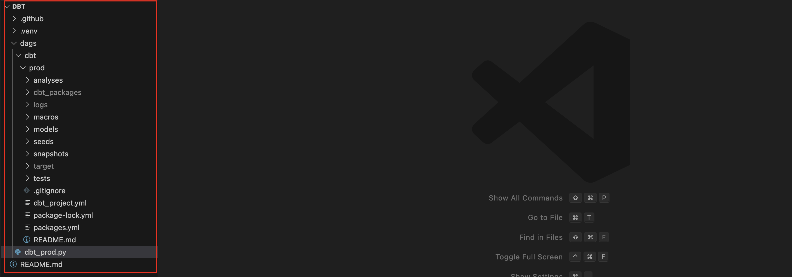
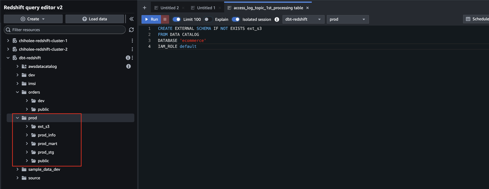

DBT Overview


Elastic IP


Redshift Cluster 생성


endpoint : dbt-redshift.cncx5aab3wic.ap-northeast-2.redshift.amazonaws.com

> [!TIP]
> 만약 private subnet에 생성했다면 아래와 같이 포트포워딩 사용
> 
> ssh -i /Users/chiholee/Desktop/Project/keys/chiholee-datalake02.pem -L 15439:chiholee-redshift-cluster-1.cncx5aab3wic.ap-northeast-2.redshift.amazonaws.com:5439 ec2-user@43.203.213.41


데이터베이스 생성
```sql
create database prod;
```


dbt 환경 셋업
```bash
mkdir chiholee_dbt
python3.10 -m venv .venv
source .venv/bin/activate
pip install --upgrade pip
pip install dbt-core
pip install dbt-redshift
```

```bash
mkdir dags; cd dags
mkdir dbt; cd dbt

dbt init prod
Which database would you like to use? 1
[1] redshift
[2] postgres

host (hostname.region.redshift.amazonaws.com): dbt-redshift.cncx5aab3wic.ap-northeast-2.redshift.amazonaws.com

port [5439]: 5439

user (dev username): admin

[1] password
[2] iam
Desired authentication method option (enter a number): 1

password (dev password): Admin1234

dbname (default database that dbt will build objects in): prod

schema (default schema that dbt will build objects in): prod

threads (1 or more) [1]: 1

14:00:43  Profile first_dbt written to /Users/chiholee/.dbt/profiles.yml using target's profile_template.yml and your supplied values. Run 'dbt debug' to validate the connection.
```

설치 확인
```bash
cd prod
dbt debug
```


DBT 디렉토리 구조


source layer 데이터 생성
```sql
-- Redshift default 역할에 AWSGlueServiceRole 정책 추가
CREATE EXTERNAL SCHEMA IF NOT EXISTS ext_s3
FROM DATA CATALOG
DATABASE 'ecommerce'
IAM_ROLE default
```


[DBT 코드 참고](https://github.com/color275/dbt)


```bash
dbt run
```

### dbt run 이 후 redshift 버전
