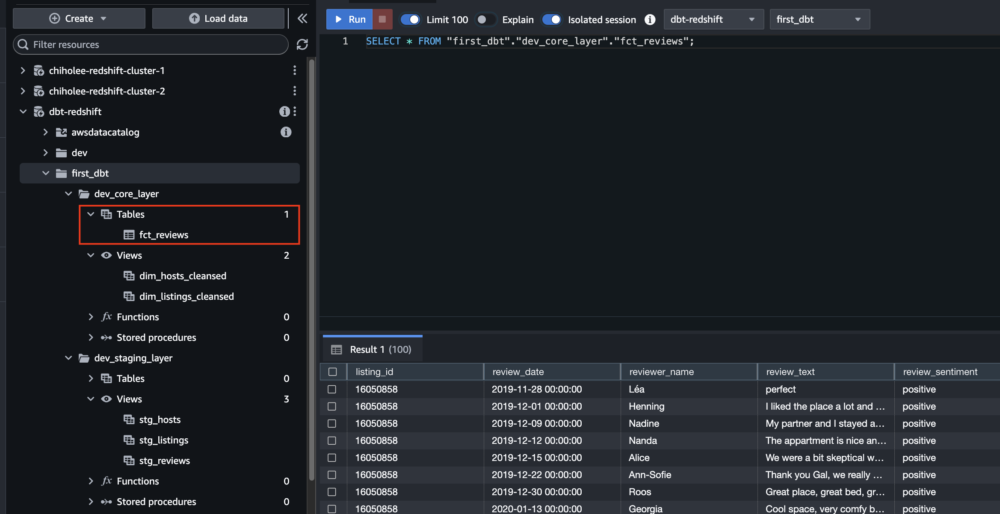

DBT Overview


Elastic IP


Redshift Cluster 생성


endpoint : dbt-redshift.cncx5aab3wic.ap-northeast-2.redshift.amazonaws.com

> [!TIP]
> ssh -i /Users/chiholee/Desktop/Project/keys/chiholee-datalake02.pem -L 15439:chiholee-redshift-cluster-1.cncx5aab3wic.ap-northeast-2.redshift.amazonaws.com:5439 ec2-user@43.203.213.41


데이터베이스 생성
```sql
create database first_dbt;
```


dbt 환경 셋업
```bash
mkdir chiholee_dbt
python3.10 -m venv .venv
source .venv/bin/activate
pip install --upgrade pip
pip install dbt-core
pip install dbt-redshift
```

```bash
dbt init first_dbt
Which database would you like to use? 1
[1] redshift
[2] postgres

host (hostname.region.redshift.amazonaws.com): dbt-redshift.cncx5aab3wic.ap-northeast-2.redshift.amazonaws.com

port [5439]: 5439

user (dev username): admin

[1] password
[2] iam
Desired authentication method option (enter a number): 1

password (dev password): Admin1234

dbname (default database that dbt will build objects in): first_dbt

schema (default schema that dbt will build objects in): dev

threads (1 or more) [1]: 1

14:00:43  Profile first_dbt written to /Users/chiholee/.dbt/profiles.yml using target's profile_template.yml and your supplied values. Run 'dbt debug' to validate the connection.
```

설치 확인
```bash
cd first_dbt
dbt debug
```


DBT 디렉토리 구조


raw_layer 데이터 생성
```sql
create schema raw_layer;

CREATE TABLE raw_layer.raw_listings
                    (id integer,
                     listing_url varchar(256),
                     name varchar(256),
                     room_type varchar(256),
                     minimum_nights integer,
                     host_id integer,
                     price varchar(256),
                     created_at timestamp,
                     updated_at timestamp);


COPY raw_layer.raw_listings (id,
                        listing_url,
                        name,
                        room_type,
                        minimum_nights,
                        host_id,
                        price,
                        created_at,
                        updated_at)
                   from 's3://dbtlearn/listings.csv'                   
                   DELIMITER ','
                   REGION 'us-east-2'
                   TIMEFORMAT 'YYYY-MM-DDTHH:MI:SS' 
                   IAM_ROLE default
                   format as CSV
                   IGNOREHEADER as 1;
                    

CREATE TABLE raw_layer.raw_reviews
                    (listing_id integer,
                     date timestamp,
                     reviewer_name varchar(256),
                     comments varchar(65535),
                     sentiment varchar(256));
                    
COPY raw_layer.raw_reviews (listing_id, date, reviewer_name, comments, sentiment)
                   from 's3://dbtlearn/reviews.csv'
                   DELIMITER ','
                   REGION 'us-east-2'
                   TIMEFORMAT 'YYYY-MM-DDTHH:MI:SS' 
                   IAM_ROLE default
                   format as CSV
                   IGNOREHEADER as 1;
                    

CREATE TABLE raw_layer.raw_hosts
                    (id integer,
                     name varchar(256),
                     is_superhost varchar(256),
                     created_at timestamp,
                     updated_at timestamp);
                    
COPY raw_layer.raw_hosts (id, name, is_superhost, created_at, updated_at)
                   from 's3://dbtlearn/hosts.csv'
                   DELIMITER ','
                   REGION 'us-east-2'
                   IAM_ROLE default
                   format as CSV
                   IGNOREHEADER as 1;
```


stg model 구성

models/stg/stg_hosts.sql
```sql
WITH raw_hosts AS (
    SELECT
        *
    FROM
       first_dbt.raw_layer.raw_hosts
)
SELECT
    id AS host_id,
    NAME AS host_name,
    is_superhost,
    created_at,
    updated_at
FROM
    raw_hosts
```

models/stg/stg_listings.sql
```sql
WITH raw_listings AS (
    SELECT
        *
    FROM
        first_dbt.raw_layer.raw_listings
)
SELECT
    id AS listing_id,
    name AS listing_name,
    listing_url,
    room_type,
    minimum_nights,
    host_id,
    price AS price_str,
    created_at,
    updated_at
FROM
    raw_listings
```

models/stg/stg_reviews.sql
```sql
WITH raw_reviews AS (
    SELECT
        *
    FROM
        first_dbt.raw_layer.raw_reviews
)
SELECT
    listing_id,
    date AS review_date,
    reviewer_name,
    comments AS review_text,
    sentiment AS review_sentiment
FROM
    raw_reviews
```

dbt_project.yml
```yml
models:
  first_dbt:
    +schema: staging_layer
```

적용
```bash
dbt run
````


core model 구성

models/core/dim_hosts_cleansed.sql
```sql
WITH src_hosts AS (
    SELECT
        *
    FROM
        {{ ref('stg_hosts') }}
)
SELECT
    host_id,
    NVL(
        host_name,
        'Anonymous'
    ) AS host_name,
    is_superhost,
    created_at,
    updated_at
FROM
    src_hosts
```

models/core/dim_listings_cleansed.sql
```sql
WITH src_listings AS (
  SELECT
    *
  FROM
    {{ ref('stg_listings') }}
)
SELECT
  listing_id,
  listing_name,
  room_type,
  CASE
    WHEN minimum_nights = 0 THEN 1
    ELSE minimum_nights
  END AS minimum_nights,
  host_id,
  CAST(
    REPLACE(
      price_str,
      '$',
      ''
    ) AS DECIMAL(10, 2)
  ) AS price,
  created_at,
  updated_at
FROM
  src_listings
```

dbt_project.yml
```yml
models:
  first_dbt:
    stg:
      +schema: staging_layer
    core:
      +schema: core_layer
```

적용
```bash
dbt run
```


Incremental Models

models/core/fct_reviews.sql
```sql
{{
  config(
    materialized = 'incremental',
    on_schema_change='fail'
    )
}}
WITH stg_reviews AS (
  SELECT * FROM {{ ref('stg_reviews') }}  
)
SELECT * FROM stg_reviews
WHERE review_text is not null


  AND review_date > (select max(review_date) from {{ this }})

```




Documentation
models/schema.yml
```yml
version: 2

models:
- name: dim_listings_cleansed
  description: Cleansed table which contains Airbnb listings.
  columns:

  - name: listing_id
    description: Primary key for the listing

  - name: host_id
    description: The hosts's id. References the host table.

  - name: room_type
    description: Type of the apartment / room

  - name: minimum_nights
    description: minimum_nights

- name: dim_hosts_cleansed
  columns:
  - name: host_id

  - name: host_name

  - name: is_superhost

- name: fct_reviews
  columns:
  - name: listing_id

  - name: reviewer_name

  - name: review_sentiment
```

docs web 실행
```bash
dbt docs generate
dbt docs serve
```
Project

Database

Lineage Graph


MWAA(Airflow)와 통합

https://astronomer.github.io/astronomer-cosmos/getting_started/mwaa.html

cd /Users/chiholee/Desktop/Project/datalake/12.dbt/chiholee_dbt/mwaa

aws s3 cp startup.sh s3://chiholee-datalake0002/mwaa/startup.sh
aws s3 cp requirements.txt s3://chiholee-datalake0002/mwaa/requirements.txt
aws s3 cp ../first_dbt/ s3://chiholee-datalake0002/mwaa/dags/dbt/first_dbt/ --recursive
aws s3 cp my_cosmos_dag.py s3://chiholee-datalake0002/mwaa/dags/my_cosmos_dag.py


