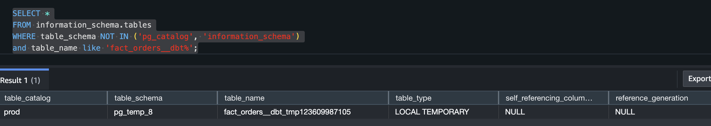

Welcome to your new dbt project!

### Using the starter project

Try running the following commands:
- dbt run
- dbt test


### Resources:
- Learn more about dbt [in the docs](https://docs.getdbt.com/docs/introduction)
- Check out [Discourse](https://discourse.getdbt.com/) for commonly asked questions and answers
- Join the [chat](https://community.getdbt.com/) on Slack for live discussions and support
- Find [dbt events](https://events.getdbt.com) near you
- Check out [the blog](https://blog.getdbt.com/) for the latest news on dbt's development and best practices





# dist 키 차이

### order_id 를 dist 키 적용 전
```sql
XN Hash Left Join DS_BCAST_INNER  (cost=1316518.88..2094130.28 rows=652 width=47) 
  Hash Cond: ("outer".oid = "inner".oid)  
  Filter: ("inner".oid IS NULL) 
  ->  XN Seq Scan on tmp_orders dbt_internal_source  (cost=0.00..6.52 rows=652 width=51)  
  ->  XN Hash  (cost=1316508.35..1316508.35 rows=648 width=4) 
        ->  XN Hash Join DS_DIST_OUTER  (cost=793310.32..1316508.35 rows=648 width=4) 
              Outer Dist Key: dbt_internal_source.order_id  
              Hash Cond: ("outer".order_id = "inner".order_id)  
              ->  XN Seq Scan on tmp_orders dbt_internal_source  (cost=0.00..6.52 rows=652 width=8) 
              ->  XN Hash  (cost=793306.45..793306.45 rows=652 width=4) 
                    ->  XN Subquery Scan volt_dt_2  (cost=793299.93..793306.45 rows=652 width=4)  
                          ->  XN HashAggregate  (cost=793299.93..793299.93 rows=652 width=4)  
                                ->  XN Hash Join DS_BCAST_INNER  (cost=17.12..793298.28 rows=662 width=4) 
                                      Hash Cond: ("outer".order_id = "inner".order_id)  
                                      ->  XN Seq Scan on fact_orders  (cost=0.00..7253.00 rows=725300 width=4)  
                                      ->  XN Hash  (cost=6.52..6.52 rows=652 width=4) 
                                            ->  XN Seq Scan on tmp_orders dbt_internal_source  (cost=0.00..6.52 rows=652 width=4) 
  
XN Hash Join DS_BCAST_INNER  (cost=26.08..3662107.24 rows=662 width=84) 
  Hash Cond: ("outer".order_id = "inner".order_id)  
  ->  XN Seq Scan on fact_orders  (cost=0.00..7253.00 rows=725300 width=41) 
  ->  XN Hash  (cost=6.52..6.52 rows=652 width=47)  
        ->  XN Seq Scan on tmp_orders dbt_internal_source  (cost=0.00..6.52 rows=652 width=47)  
  
XN Seq Scan on merge_tt_61c8c1e6c2a9a  (cost=0.00..5.87 rows=587 width=47)  
```

### order_id 를 dist 키 적용 후
```sql
XN Hash Left Join DS_BCAST_INNER  (cost=925319.75..1702931.15 rows=652 width=47)	
  Hash Cond: ("outer".oid = "inner".oid)	
  Filter: ("inner".oid IS NULL)	
  ->  XN Seq Scan on tmp_orders dbt_internal_source  (cost=0.00..6.52 rows=652 width=51)	
  ->  XN Hash  (cost=925309.22..925309.22 rows=648 width=4)	
        ->  XN Hash Join DS_DIST_OUTER  (cost=402111.19..925309.22 rows=648 width=4)	
              Outer Dist Key: dbt_internal_source.order_id	
              Hash Cond: ("outer".order_id = "inner".order_id)	
              ->  XN Seq Scan on tmp_orders dbt_internal_source  (cost=0.00..6.52 rows=652 width=8)	
              ->  XN Hash  (cost=402107.32..402107.32 rows=652 width=4)	
                    ->  XN Subquery Scan volt_dt_2  (cost=402100.80..402107.32 rows=652 width=4)	
                          ->  XN HashAggregate  (cost=402100.80..402100.80 rows=652 width=4)	
                                ->  XN Hash Join DS_DIST_INNER  (cost=10.42..402099.15 rows=661 width=4)	
                                      Inner Dist Key: dbt_internal_source.order_id	
                                      Hash Cond: ("outer".order_id = "inner".order_id)	
                                      ->  XN Seq Scan on fact_orders  (cost=0.00..7258.87 rows=725887 width=4)	
                                      ->  XN Hash  (cost=6.52..6.52 rows=652 width=4)	
                                            ->  XN Seq Scan on tmp_orders dbt_internal_source  (cost=0.00..6.52 rows=652 width=4)	
	
XN Hash Join DS_DIST_INNER  (cost=12.69..1836501.42 rows=661 width=84)	
  Inner Dist Key: dbt_internal_source.order_id	
  Hash Cond: ("outer".order_id = "inner".order_id)	
  ->  XN Seq Scan on fact_orders  (cost=0.00..7258.87 rows=725887 width=41)	
  ->  XN Hash  (cost=6.52..6.52 rows=652 width=47)	
        ->  XN Seq Scan on tmp_orders dbt_internal_source  (cost=0.00..6.52 rows=652 width=47)	
	
XN Seq Scan on merge_tt_61c8c2cd6ea26  (cost=0.00..5.80 rows=580 width=85)	
```

1.	비용 감소:
•	튜닝 전: (cost=1316518.88..2094130.28)
•	튜닝 후: (cost=925319.75..1702931.15)
•	비용이 전반적으로 감소했습니다, 이는 쿼리 성능이 개선되었음을 나타냅니다.
2.	조인 전략 변경:
•	튜닝 전: DS_BCAST_INNER
•	튜닝 후: DS_DIST_OUTER, DS_DIST_INNER
•	분산 조인으로 변경되어 데이터 이동이 최적화되었습니다.
3.	분산 키 활용:
•	tmp_orders와 fact_orders 테이블의 분산 키로 order_id를 사용하여 조인 성능이 향상되었습니다.

구체적인 변경 사항:

•	조인 방식 최적화:
•	DS_BCAST_INNER에서 DS_DIST_OUTER 및 DS_DIST_INNER로 변경하여 조인 성능 향상.
•	Inner/Outer 분산 키 설정으로 데이터 이동 최소화.

결과:

•	비용 절감: 실행 계획의 비용이 줄어들어 성능이 향상됨.
•	조인 효율성 증가: 데이터 이동이 줄어들고 조인 작업이 더 효율적으로 수행됨.

결론:

분산 키와 정렬 키를 적절하게 설정하고 조인 전략을 최적화함으로써 Redshift 쿼리의 성능을 크게 향상시킬 수 있었습니다.