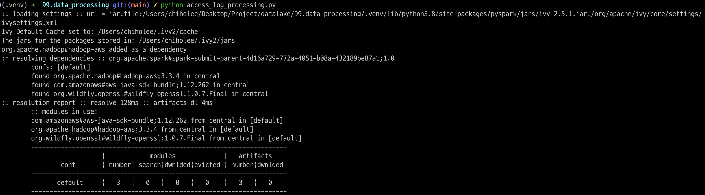
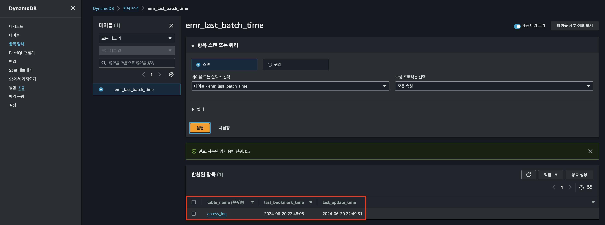
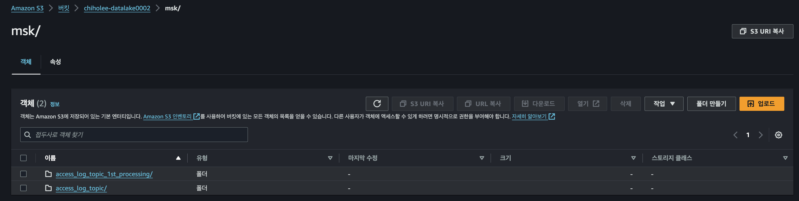
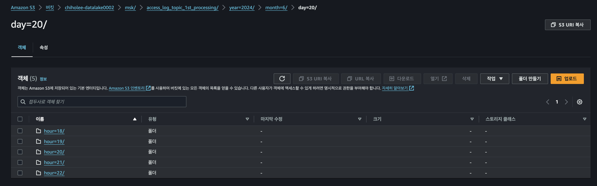
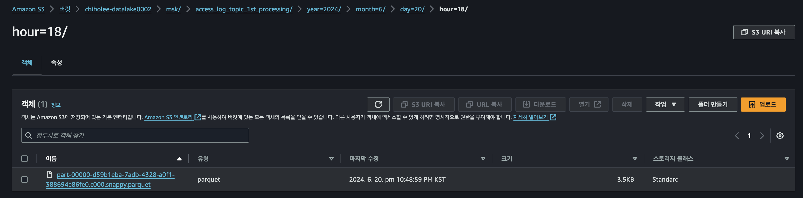
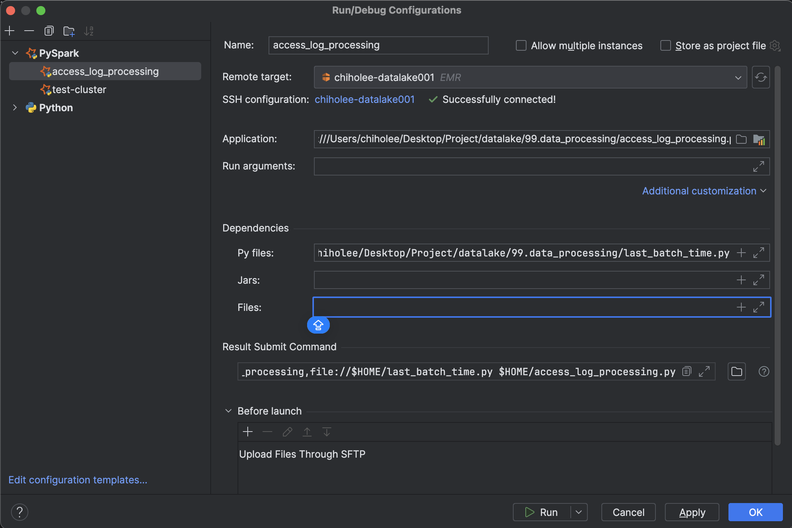
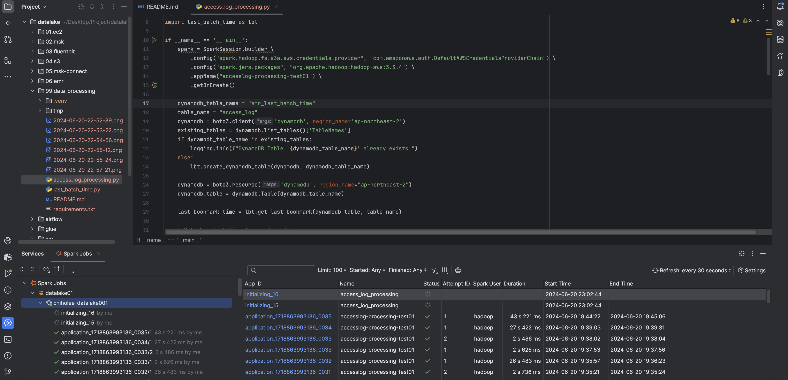
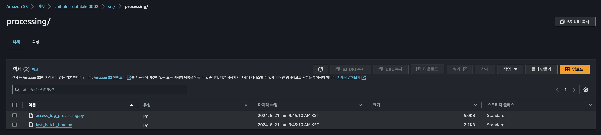

# AccessLog 
WebServer -> MSK -> S3 파이프라인을 통해 json 형태로 저장되어 있는 Accesslog 를 필요한 컬럼을 구분한 TABLE 포맷의 parquet 로 전처리 한다.

### 환경 변수 준비
```bash
export DATALAKE_DIR=/Users/chiholee/Desktop/Project/datalake
```

### 원본
```json
{
  "@timestamp": 1718861247.345325,
  "log": "|2024-06-20 14:27:27| 46.255.147.32 - - \"GET /basket?product_id=2&customer_id=61 HTTP/1.1\" 200 1576"
}
```

### 전처리 후
```json
{
  "timestamp": "2024-06-20 14:30:49",
  "ip_address": "47.242.162.82",
  "http_method": "GET",
  "endpoint": "/products?product_id=1&customer_id=22",
  "service": "products",
  "protocol": "HTTP/1.1",
  "status_code": 200,
  "response_size": 1576,
  "product_id": 1,
  "customer_id": 22
}
```

### venv 설정
```bash
cd $DATALAKE_DIR/99.data_processing
python3 -m venv .venv
source .venv/bin/activate
pip install --upgrade pip
pip install -r requirements.txt
```

### pyspark 테스트
```bash
export AWS_PROFILE=xxxxxx
python $DATALAKE_DIR/src/access_log_processing.py
```
#### pyspark 실행

#### dynamodb 에 bookmark 가 저장됨

#### S3





### pyCharm 설정



### spark-submit

#### cluster mode
```bash
/bin/spark-submit
--master yarn
--deploy-mode cluster
--name access_log_processing
--py-files $DATALAKE_DIR/src/last_batch_time.py
$DATALAKE_DIR/src/access_log_processing.py
```

#### local mode
```bash
/bin/spark-submit 
--master local 
--deploy-mode client 
--name access_log_processing 
--py-files $DATALAKE_DIR/src/last_batch_time.py 
$DATALAKE_DIR/src/access_log_processing.py
```


### S3에 업로드
```bash
aws s3 sync $DATALAKE_DIR/src/ s3://chiholee-datalake0002/src/processing/
```
