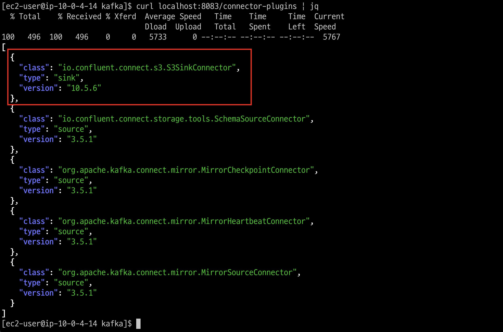
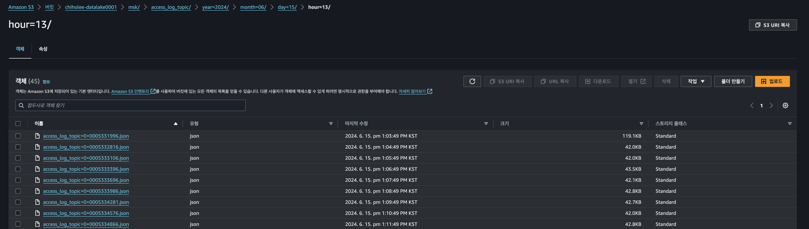

# MSK-CONNECT 구축

## MSK Config Provider 설치
1. msk-config-providers 다운로드
```bash
export HOME_DIR=~
mkdir $HOME_DIR/kafka/plugins
mkdir $HOME_DIR/kafka/plugins/msk-config-providers
cd $HOME_DIR/media
wget https://github.com/aws-samples/msk-config-providers/releases/download/r0.1.0/msk-config-providers-0.1.0-with-dependencies.zip
sudo unzip msk-config-providers-0.1.0-with-dependencies.zip -d $HOME_DIR/kafka/plugins/msk-config-providers/
cd $HOME_DIR/kafka/plugins/msk-config-providers/
```

1. connect-distributed.properties 설정
```bash
# vi $HOME_DIR/kafka/config/connect-distributed.properties
cp $HOME_DIR/kafka/config/connect-distributed.properties $HOME_DIR/kafka/config/connect-distributed.properties.cp
cat << EOF > $HOME_DIR/kafka/config/connect-distributed.properties
bootstrap.servers=$MSK_BOOTSTRAP_ADDRESS

group.id=kafka-connect-cluster

key.converter.schemas.enable=true
key.converter=org.apache.kafka.connect.json.JsonConverter
value.converter.schemas.enable=true
value.converter=org.apache.kafka.connect.json.JsonConverter

offset.storage.topic=kafka-connect-offsets
offset.storage.replication.factor=2

config.storage.topic=kafka-connect-configs
config.storage.replication.factor=2

status.storage.topic=kafka-connect-status
status.storage.replication.factor=2

offset.flush.interval.ms=10000
plugin.path=$HOME_DIR/kafka/plugins
EOF
```

## S3 Sink 셋업
1. Confluent S3 Sink 다운로드
   ```bash
   export HOME_DIR=~
   cd $HOME_DIR; cd media
   wget https://d1i4a15mxbxib1.cloudfront.net/api/plugins/confluentinc/kafka-connect-s3/versions/10.5.6/confluentinc-kafka-connect-s3-10.5.6.zip
   sudo unzip confluentinc-kafka-connect-s3-10.5.6.zip -d $HOME_DIR/kafka/plugins/
   cd $HOME_DIR/kafka/plugins
   ```
   


1. Connect 실행
   ```bash
   # 실행
   $HOME_DIR/kafka/bin/connect-distributed.sh -daemon $HOME_DIR/kafka/config/connect-distributed.properties
   # 프로세스 확인
   ps -ef| grep connect-distributed.properties
   # 포트 확인
   sudo netstat -antp | grep 8083
   ```

1. Connect 실행 로그 확인
   ```bash
   tail -f $HOME_DIR/kafka/logs/connect.log
   ```

1. Connect List 확인
   ```bash
   curl localhost:8083/connector-plugins | jq
   ````


1. Sink Connector 생성
   ```bash
   export S3_BUCKET=chiholee-datalake0001
   export TOPICE_NAME=access_log_topic
   export S3_DIR=msk

   # flush.size : 1000건씩
   # rotate.interval.ms : 60000(1분마다)

   curl -X PUT "http://localhost:8083/connectors/s3-sink-connector/pause" | jq
   curl -X DELETE "http://localhost:8083/connectors/s3-sink-connector" | jq
   curl --location --request POST 'http://localhost:8083/connectors' \
   --header 'Content-Type: application/json' \
   --data-raw '{
     "name": "s3-sink-connector",
     "config": {
       "connector.class":"io.confluent.connect.s3.S3SinkConnector",
   	"s3.region":"ap-northeast-2",
   	"flush.size":"1000",
       "rotate.interval.ms":"60000",
   	"schema.compatibility":"NONE",
   	"tasks.max":"1",
   	"topics":"'"$TOPICE_NAME"'",
   	"value.converter.schemas.enable":"false",
   	"format.class":"io.confluent.connect.s3.format.json.JsonFormat",
   	"key.converter":"org.apache.kafka.connect.storage.StringConverter",
   	"value.converter":"org.apache.kafka.connect.json.JsonConverter",
   	"storage.class":"io.confluent.connect.s3.storage.S3Storage",
   	"s3.bucket.name":"'"$S3_BUCKET"'",
       "topics.dir":"'"$S3_DIR"'",
   	"partition.duration.ms":"3600000",
   	"partitioner.class":"io.confluent.connect.storage.partitioner.TimeBasedPartitioner",
   	"path.format":"'\'year\''=YYYY/'\'month\''=MM/'\'day\''=dd/'\'hour\''=HH",
   	"timezone":"Asia/Seoul",
   	"locale":"ko_KR"
     }
   }' | jq
   ```

1. Sink Connector 확인
   ```bash
   # connect list
   curl --location --request GET 'http://localhost:8083/connectors' | jq
   # connect status
   curl --location --request GET 'http://localhost:8083/connectors/s3-sink-connector/status' | jq
   # connect config
   curl -X GET "http://localhost:8083/connectors/s3-sink-connector/config" | jq

   tail -f $HOME_DIR/kafka/logs/connect.log
   ```

1. Kafka Consume 상태 확인
   ```bash
   kafka-consumer-groups.sh \
   --bootstrap-server $MSK_BOOTSTRAP_ADDRESS \
   --list

   kafka-consumer-groups.sh \
   --bootstrap-server $MSK_BOOTSTRAP_ADDRESS \
   --group connect-s3-sink-connector --offsets --describe
   ```

1. S3 확인
