# Create MSK

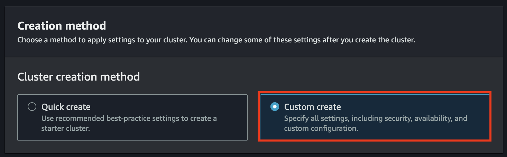

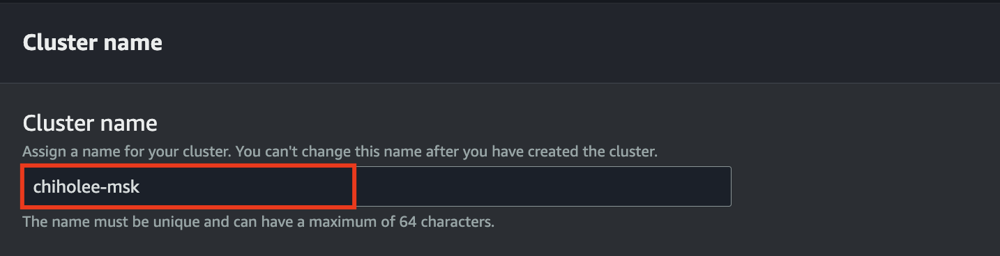

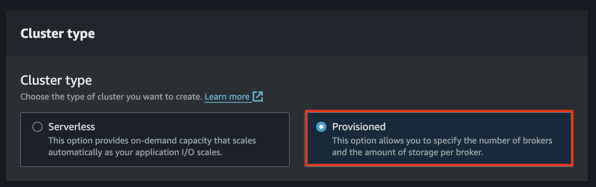

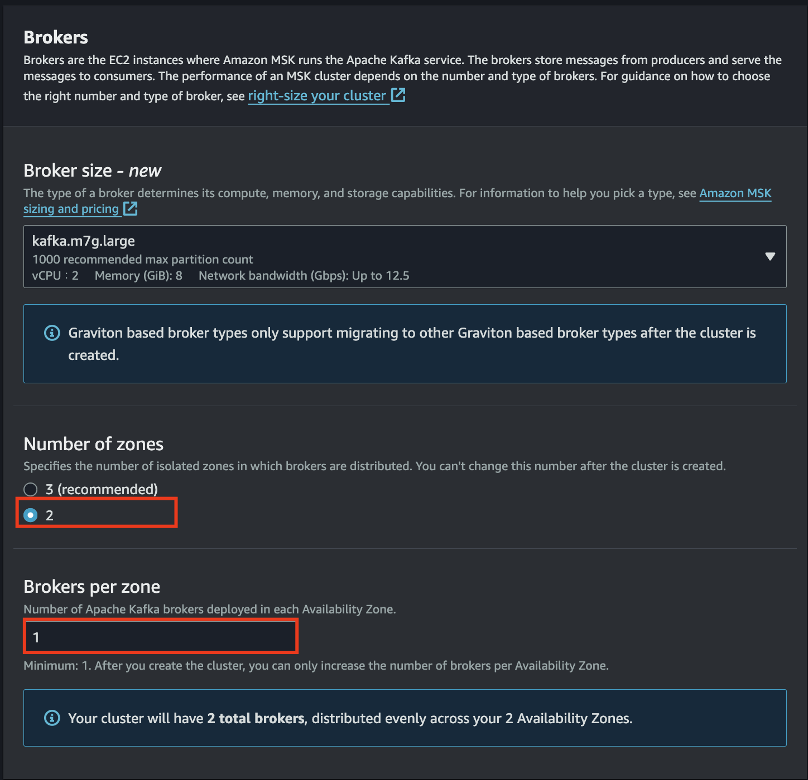

Next

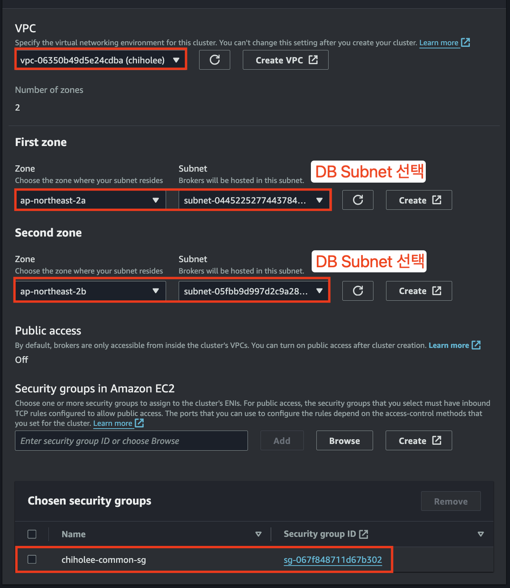

Next

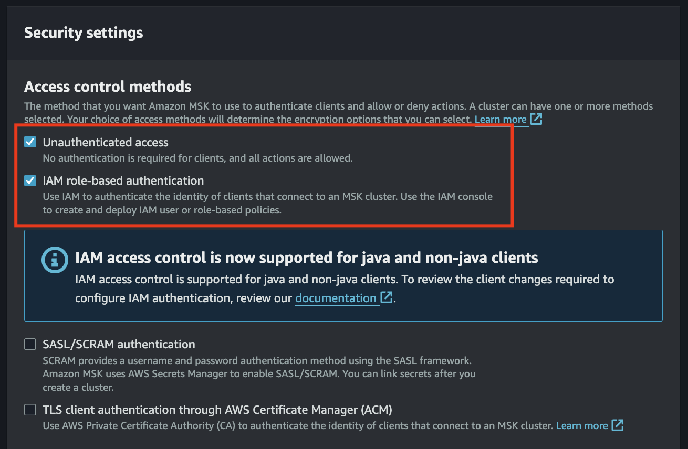

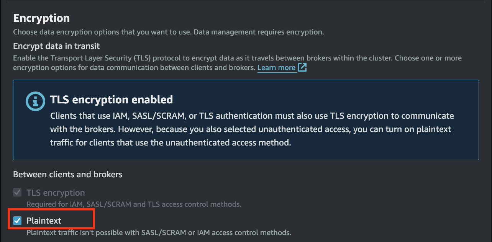

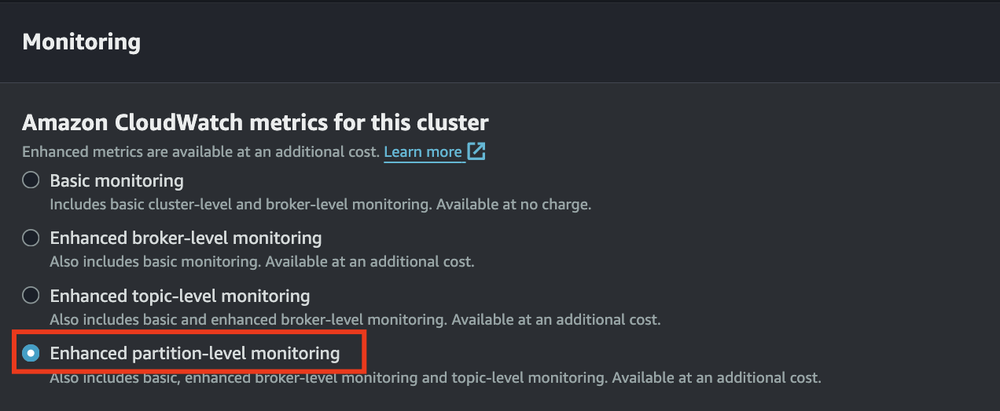

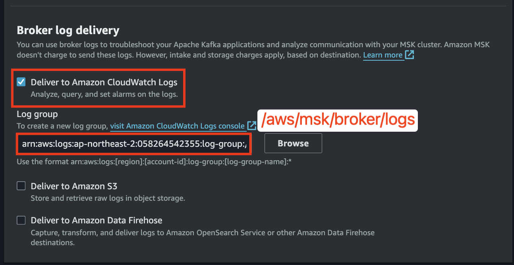

Next

Create cluster

# MSK, Kafka Cient Setup
- WebServer SSH 접속
- Java Install
    ```bash
    cd ~
    mkdir media
    cd media
    wget https://corretto.aws/downloads/latest/amazon-corretto-21-x64-al2023-jdk.rpm
    wget https://corretto.aws/downloads/latest/amazon-corretto-21-x64-al2023-jre.rpm
    sudo yum localinstall -y amazon-corretto-21-x64-al2023-jdk.rpm amazon-corretto-21-x64-al2023-jre.rpm
    which java
    java -version
    ```
- Kafka client 설치
    ```bash
    cd ~
    cd media
    wget https://archive.apache.org/dist/kafka/3.5.1/kafka_2.13-3.5.1.tgz
    tar xvf kafka_2.13-3.5.1.tgz
    cd ..
    ln -s ./media/kafka_2.13-3.5.1 kafka
    ```
- kafka bootstrap 환경설정 (MSK_BOOTSTRAP_ADDRESS는 생성한 MSK 클러스터의 View client information 에서 확인)
    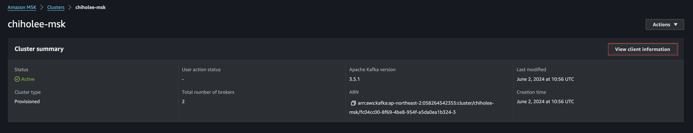
    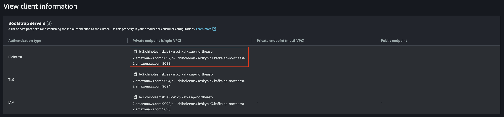
    ```bash
    echo 'export MSK_BOOTSTRAP_ADDRESS=b-2.chiholeemsk.ie9kyn.c3.kafka.ap-northeast-2.amazonaws.com:9092,b-1.chiholeemsk.ie9kyn.c3.kafka.ap-northeast-2.amazonaws.com:9092' >> ~/.bash_profile
    echo 'export PATH=$PATH:$HOME/kafka/bin' >> ~/.bash_profile
    . ~/.bash_profile
    ```
- MSK Default Topic 확인
  - Unauthenticated access 로 접근, IAM 통한 접근은 별도 설정 필요
  - Common SG 가 SELF로 모든 포트에 대해 inbound rule 이 허용되어 있으므로 방화벽 설정은 필요없음
    ```bash
    kafka-topics.sh \
    --bootstrap-server $MSK_BOOTSTRAP_ADDRESS \
    --list
    ````
    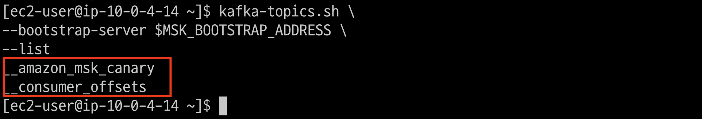